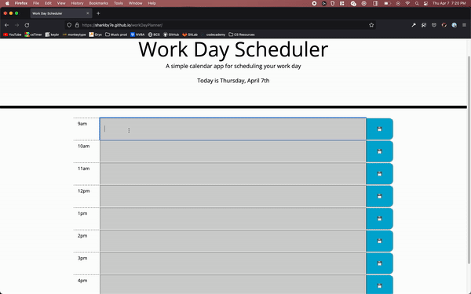

# Work Day Planner 

## Description 
This application is supposed to help the user plan their workday. It has interactive features, including save buttons that save events
to local storage, and live updating date and formatting that used Moment.js. 
## Link and Preview of the site

[Click to view the live application](https://sharkby7e.github.io/workDayPlanner/)



## Technologies Employed

| Techlogy   | Implementation/Use              |
|:----------:|---------------------------------|
|HTML        | Structure of Webpage            |
|Bootstrap   | Styling of Application          |
|JQuery      | Dynamically updating the DOM    |
|Moment.js   | Live updating date and classes  |

## Key Functions

### updateTxtColors 
This was the function that would update the colors of the columns based on the time of day. The today variable 
pointed to an instance of Moment.js, and by formatting it to the H format, I was able to compare it to the hours
that were layed out on my table. Within an earlier function, I used Jquery to add a new class to those elements on the page
which would change based on the time of day. This was a neat feature.

```javascript
function updateTxtColors(t) {
  var colorClass = ""
    if(today.format('H')>t){
      colorClass+= "past"
    } else if(today.format('H')<t){
      colorClass+= "future"
    } else{
      colorClass+= "present"
    }
  return colorClass
}
```

### saveToMemory and writeFromMemory 
These were the two main functions that worked with localStorage, which allows the user to save events to the planner
even if they were to navigate away from the page. These functions were called within my big loop, which created all
of the rows from an array of numbers 9-17, representing the hours of the day. 

```javascript
function saveToMemory(k,v) {
  memory[k] = v
  localStorage.setItem("mem",JSON.stringify(memory))
}

function writeFromMemory(t){
  var obj = JSON.parse(localStorage.getItem("mem"))
  if(obj ===null){
    return
  }
  var content= ''
  if(!obj[t]){
    content += ""
  } else{
    content+= obj[t]
  }
  return content
}
```
## Summary and Learning Points
As a developer, I know that I will sometimes be given code that I will have to modify. It is nice to start 
from scratch because I can build everything and know exactly how it works, and can modify easier. Taking code
that someone else has written, and trying to modify it takes a different skill, where I have to try and intrepret
the intentions of the writer before. There was definitely a way to complete this project by disregarding the given code, 
but I wanted to try and honor what was given to me, and try to make interpret what the initial designer had intended. 
Switching from vanilla JS to Jquery, and from plain CSS to Bootstrap definitely had me frustated at times, but after 
a bit, I started to realize how these tools actually made a lot of tasks a lot quicker and more efficient. 
